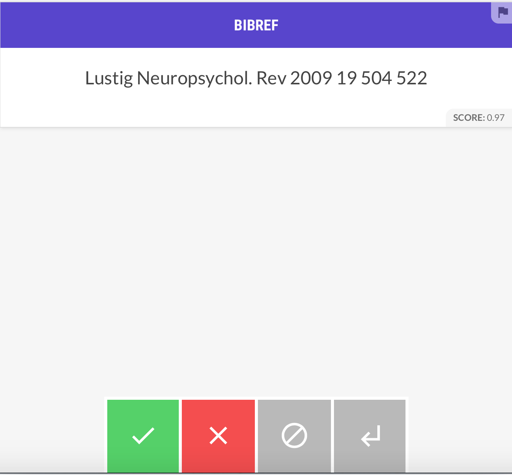

# GUIDELINES Appendix - False positive classifier

## Background

After a first examination of the `BIBREF` extraction  results, we observed a high rate of False Positives detected by Grobid leading to a relatively low precision (0.40-0.45). Here, the goal is to build on the attributes parsed by GROBID when it extracts a `BIBREF` to train a "False positive" classifier. The overarching objective is to improve the *ex-post* precision of the BIBREF detection/classification pipeline.

## `BIBREF` false positive classification task

A sample of `BIBREF` extracted by Grobid are displayed one by one. The task, is simply to Accept or Reject the extract.

##### Prodigy preview

At the end of the day, **1,700 extracts** were reviewed and classified as True or False Positives.

## Q&A

##### Reminder: What is a `BIBREF`?

A `BIBREF` is any non-patent bibliographical reference that is made in the patent text body. It includes references to:

- books
- scientific articles
- technical reports
- engineering notices (such as IETF requests for comments)
- other white papers with a disclosure intent

##### What were the classifying criteria?

A Grobid extract was classified as a True Positive `BIBREF` as soon as it included two (or more) of the following arguments:

* Title (or numerical code) of the paper
* Title of the Journal
* Date of release
* Author's name
* Url
* ...

*Eg: `Lustig Neuropsychol. Rev 2009 19 504 522`* includes 4 arguments (Author: `Lustig`, Journal:`Neuropsychol. Rev`, Date: `2009`, and Numerical Code:`19 504 522`)

## In practice

Just as examined on the first patents pool, the False Positives were mainly of the following types:

| Error Type           | Example         |
|:-------------------- |:----------------|
| *Patent citation* or *Standards references*  |  ` Scott W Moyer J Arends Us Patent Pending, “Data Processor System`   or `Described In Astm D1316-68, Which Was Approved In 1968`            |
| *Reference to industrial companies producing elements necessary to the patent*  | `Manufacture Of Artificial Pbodiicts ` `Arie Van Halewijn... Enka 1942-07-07`|
| *Graph & Appendix Description*  | `C-Nmr 7` or `Physical Ram Bank 2153 Acts As Logical Input Ram Bank 2251`|
| *Too partial reference* |  `Chem` or `2005` or `Jones`|

## References

* `Prodigy`, https://prodi.gy, @2017 Copyright.
